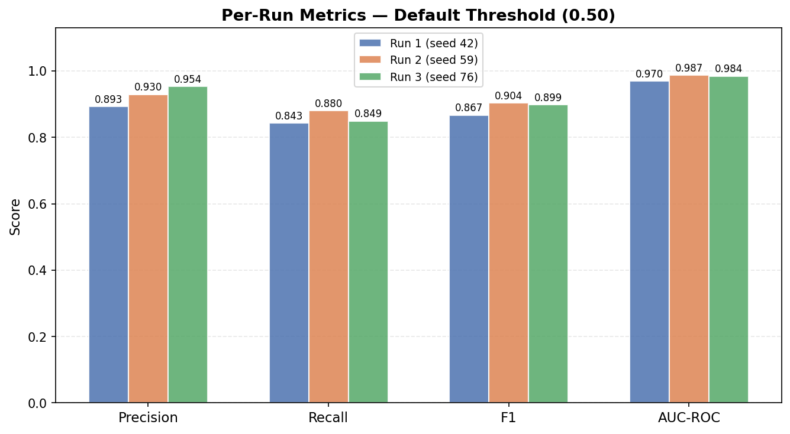
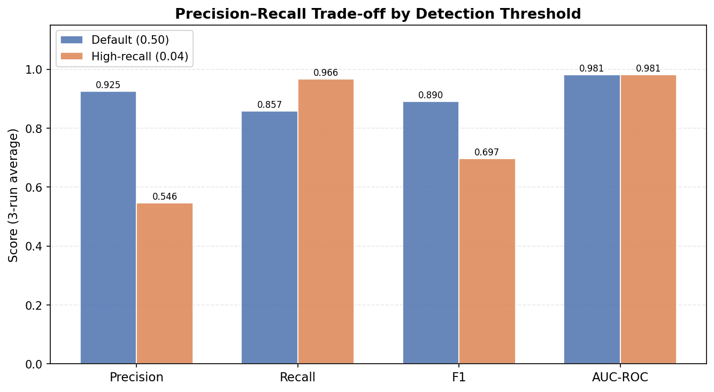
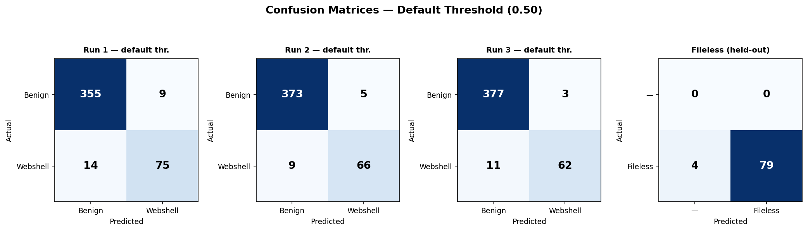
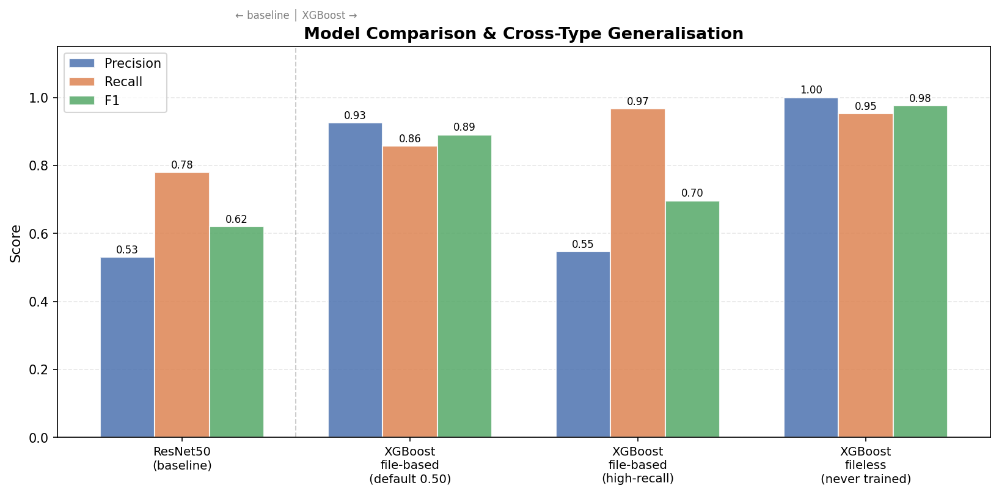

# ShellBreaker — Project Report
**Java Memory Webshell Detection via Opcode Analysis + XGBoost**

---

## 1. Problem Statement

Memory webshells (fileless webshells) inject malicious code directly into a running JVM without writing files to disk. Traditional file-based scanners miss them entirely. This project detects them by analysing the bytecode of loaded Java classes.

**Target threat:** Filter/Servlet/Listener-type memory webshells injected via Java deserialization, OGNL injection, or similar exploit chains.

---

## 2. Approach

Based on the GAShellBreaker paper (Electronics MDPI 2025), extended with:
- A gradient-boosted classifier replacing the ResNet50 image model
- A rule-based layer derived from c0ny1/java-memshell-scanner
- A tiered alert system to reduce alert fatigue

### Pipeline

```
.class bytecode
    → javap -c (disassemble)
    → Normalize opcodes to 149-opcode JVM vocabulary
    → Extract features:
        • Unigram vector  (149 dims) — opcode frequency
        • Bigram vector (22,201 dims) — opcode transition counts
        • Metadata      (   10 dims) — SourceFile, servlet interfaces,
                                       Runtime.exec, defineClass, etc.
    → XGBoost classifier (22,360 total features)
    → Rule-based check (c0ny1-derived)
    → Combined verdict with tiered alerts
```

---

## 3. Dataset

| Category | Classes | Source |
|---|---|---|
| Webshell (file-based, train/val) | 514 | 6 GitHub repos (ysoserial, marshalsec, etc.) |
| Webshell (fileless, test-only) | 83 | 6 GitHub repos (java-memshell-generator, su18/MemoryShell, etc.) |
| Benign | 2,500 | 18 GitHub repos (Tomcat, Spring, Netty, Shiro, Hibernate, etc.) |
| **Total** | **3,097** | |

**Key design:** fileless webshells are held out entirely from training. The model is trained on file-based webshells only, then evaluated on fileless shells to measure cross-type generalisation.

### 3.1 Dataset Quality & Label Noise

Webshell repos on GitHub contain not just the malicious payloads, but also hundreds of support files: HTTP clients, exception hierarchies, RMI test harnesses, data entity classes, and utility libraries. These are labelled `webshell=1` by repo membership but carry no malicious bytecode — they are label noise that suppresses both precision and recall.

Analysis of the raw scraped dataset:
- **76 files (<500 bytes):** Pure interfaces, annotation types, and empty stubs — zero meaningful opcodes. Removed before training via a 500-byte size filter.
- **67 of those 76** were already excluded by the existing `len(ops) < 4` opcode guard, confirming the two filters are complementary.
- **The deeper noise layer (500 B – 2 KB):** Exception subclasses, Spring `@Application` mains, JNDI clients, and Shiro utility classes that produce real bytecode but describe no malicious behaviour. These cannot be removed by size or opcode count alone.

**Implication:** The model's performance ceiling is set by this label noise, not by hyperparameters. A curated or real-world-intercepted dataset (as used in the original GAShellBreaker paper) would yield higher precision.

---

## 4. Model

**XGBoost** with 600 trees, `max_depth=6`, `colsample_bytree=0.4`, weighted for class imbalance (`scale_pos_weight = n_benign / n_webshell`). Trained locally in ~2 minutes — no GPU required.

**Previous attempt:** ResNet50 on 149×149 grayscale PNG (opcode bigram matrix as image). XGBoost outperforms it significantly because the feature matrices are >99% sparse — a poor fit for CNNs but ideal for gradient boosting.

**Threshold strategy:** For each of the 3 independent training runs, the threshold is tuned on the validation split to find the lowest value where precision ≥ 0.50, maximising recall. The inference threshold used in production is the average across runs.

---

## 5. Results

### 5.1 Per-Run Metrics — Default Threshold (0.50)



| Run | Seed | Trees | Precision | Recall | F1 | AUC-ROC |
|-----|------|-------|-----------|--------|----|---------|
| 1 | 42 | 326 | 0.893 | 0.843 | 0.867 | 0.970 |
| 2 | 59 | 376 | 0.930 | 0.880 | 0.904 | 0.987 |
| 3 | 76 | 366 | 0.954 | 0.849 | 0.899 | 0.984 |
| **Avg** | — | — | **0.925 ±0.025** | **0.857 ±0.016** | **0.890 ±0.016** | **0.981 ±0.008** |

### 5.2 Precision–Recall Trade-off by Threshold



| Threshold | Precision | Recall | F1 | AUC-ROC |
|---|---|---|---|---|
| Default (0.50) | **0.925** ±0.025 | 0.857 ±0.016 | 0.890 ±0.016 | **0.981** ±0.008 |
| High-recall (0.04) | 0.547 ±0.052 | **0.966** ±0.005 | 0.697 ±0.041 | **0.981** ±0.008 |

- **Default threshold** — highest confidence alerts; best for automated blocking or precision-sensitive SIEM rules.
- **High-recall threshold** — catches nearly all webshells at the cost of ~1 false positive per 2 alerts; best for catch-everything first-pass scanning feeding a human review queue.

### 5.3 Confusion Matrices



At the default threshold across the 3 runs, false negatives (missed webshells) range from 9–14, while false positives are low (3–9). The fileless confusion matrix shows 79/83 detected with zero false positives.

### 5.4 Cross-Type Generalisation — Fileless Webshells (Never Seen in Training)

| Metric | Value |
|---|---|
| Recall | **0.952** |
| Precision | **1.000** |
| F1 | **0.975** |

79 out of 83 fileless memory webshells detected. Zero false positives. This is the most important result: the model generalises from file-based to fileless webshells without ever seeing them.

### 5.5 Model Comparison



| Model | Precision | Recall | F1 | AUC |
|---|---|---|---|---|
| ResNet50 (image CNN, baseline) | 0.53 | 0.78 | 0.62 | 0.90 |
| **XGBoost — default threshold** | **0.925** | 0.857 | **0.890** | **0.981** |
| XGBoost — high-recall threshold | 0.547 | **0.966** | 0.697 | **0.981** |
| XGBoost — fileless (held-out) | **1.000** | **0.952** | **0.975** | — |

XGBoost wins on every metric. Root cause: sparse 149×149 opcode bigram matrices (~50–100 non-zero cells out of 22,201) are a poor fit for image CNNs but ideal for gradient boosting with `colsample_bytree` feature sampling.

---

## 6. Alert Tiers (Hybrid Detection)

| Tier | Condition | Action |
|---|---|---|
| **CONFIRMED** | Rule-based HIGH + ML ≥ threshold | Page on-call immediately |
| **HIGH** | ML score ≥ 0.85 | Alert immediately |
| **MEDIUM** | ML ≥ threshold OR any rule triggered | Queue for analyst review |
| **BENIGN** | Neither | No alert |

**Rule-based checks (c0ny1-derived):**
- Implements `javax.servlet.Filter`, `Servlet`, or `Listener`
- Class name contains webshell keywords (`shell`, `cmd`, `godzilla`, etc.)
- Bytecode references `Runtime.exec`, `ProcessBuilder`, `defineClass`, or `URLClassLoader`
- No `SourceFile` attribute (runtime-generated class, cannot be traced to source)

---

## 7. Limitations

1. **Label noise in training data:** File-based webshell repos contain many support classes (exception subclasses, HTTP clients, test harnesses) with no malicious behaviour but labelled as webshell=1. This is the primary driver of false negatives at the default threshold. Curated dataset or source-directory filtering would improve precision further.

2. **Precision at high recall:** At threshold 0.04, precision is 0.55 — roughly 1 in 2 alerts is a false positive. Acceptable for first-pass scanning feeding human review, not for automated blocking.

3. **Dataset size:** 514 training webshell samples is small. The high variance across runs (AUC ranging 0.970–0.987) reflects this.

4. **Tomcat-centric rules:** The rule layer targets Tomcat's Filter/Servlet/Listener injection points. Other containers (Jetty, WebLogic, JBoss, Undertow) need additional interface patterns.

5. **Static analysis only:** Cannot detect webshells that decrypt or generate their bytecode dynamically at runtime. Phase 3 (Java Agent with live bytecode instrumentation) addresses this.

---

## 8. Files

| File | Purpose |
|---|---|
| `scripts/01_collect_dataset.sh` | Clone webshell + benign repos |
| `scripts/02_compile_and_filter.py` | Compile benign Java → .class, deduplicate |
| `scripts/02b_categorize.py` | Separate file-based vs fileless webshells |
| `scripts/03_build_grayscale.py` | .class → opcode bigram matrix PNG (with size filter) |
| `scripts/04_train_resnet50.py` | ResNet50 training (superseded) |
| `scripts/04b_train_xgboost.py` | XGBoost training (current best) |
| `scripts/05_inference_api.py` | FastAPI inference server + CLI |
| `scripts/06_visualize.py` | Generate training result figures |
| `output/xgb_model.pkl` | Trained XGBoost model |
| `output/xgb_report.json` | Full training metrics (3 runs) |
| `output/dataset.csv` | Dataset manifest (path, label, type) |
| `output/vocab.json` | 149-opcode JVM vocabulary |
| `output/detections.jsonl` | Append-only detection log |
| `output/figures/` | Training visualizations (4 PNG files) |

---

## 9. References

- GAShellBreaker — Electronics MDPI 2025
- c0ny1/java-memshell-scanner — runtime rule-based scanner (JSP)
- JVM Specification Chapter 6 — opcode vocabulary
